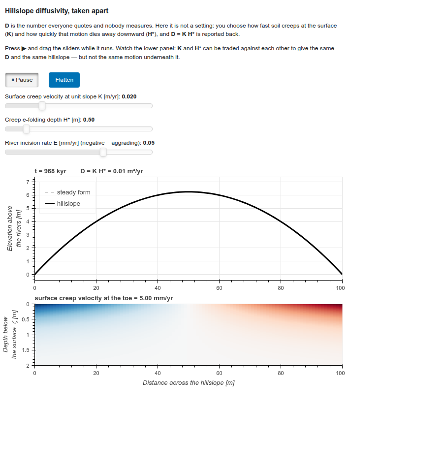

# hillcreep

**Hillslope diffusivity, taken apart.**

`D` is the most-quoted number in hillslope geomorphology and among the least
physical: fitted to topography, reported in m²/yr, and rarely connected to
anything anyone could watch happen. This model does not accept it as an input.
You set two quantities that *are* measurable — how fast soil creeps at the
surface per unit slope, and how quickly that motion dies away with depth — and
the diffusivity comes out the other end.

```
u(x, ζ) = -K ∂z/∂x · exp(-ζ / H*)          downslope creep velocity
q(x)    = ∫₀^∞ u dζ = -K H* ∂z/∂x          depth-integrated flux
D       = K H*                              reported, never set
```

`ζ` is depth below the land–air interface, positive downward. The interface
itself is moving: the hill is eroding.

## The two lessons

**`D = K H*`.** Two knobs whose product is the diffusivity. Landlab's
`DepthDependentDiffuser` says the same thing in its own docstring — "the
commonly used 'hillslope diffusivity' coefficient is equal to the product of K
and H\*" — so this is the community's law, not a new one. What is new here is
that you can see the motion it summarises.

**Surface velocity is not yours to choose.** At steady state, every grain
eroded above a point must pass that point, so `q(x') = E x'` and

```
u_s(x') = E x' / H*          no K in it
```

Move `K` across its whole range and the diffusivity changes 20-fold, the hill
gets 20 times flatter — and the surface creep velocity does not move at all.
Move `H*` and everything changes together. Two hillslopes with the same `D`,
the same shape and the same erosion rate can differ 20-fold in how fast their
surfaces are actually moving. That is what the lower panel is for.



## Install and run

```sh
pip install -e ".[test]"     # from a clone
pytest                       # 13 tests, one per claim
```

```python
from hillcreep import Hillslope

hill = Hillslope(length=100., K=0.02, H_star=0.5, incision_rate=0.05e-3)
hill.run(3.0e5)                       # years

hill.diffusivity                      # 0.01 m2/yr  = K * H_star
hill.surface_velocity()               # m/yr at each node, signed
hill.velocity_field(zeta)             # the field the diffusivity summarises
```

## The browser demo

Compiled to WebAssembly with [artesian](https://github.com/MNiMORPH/artesian),
so it runs in the reader's browser with no server:

```sh
pip install -e ".[demo]"
artesian build interactive_demo/hillcreep_panel.py -o _artesian_build \
    -p . -p ../artesian -r numpy --serve
```

`artesian build` runs the app in *this* environment to discover what it serves,
so `hillcreep` must be installed here, not merely wheeled for the browser.

## Defaults, and where they come from

| | value | |
|---|---|---|
| `L` | 100 m | hillslope width |
| `K` | 0.02 m/yr | surface creep velocity at unit slope |
| `H*` | 0.5 m | creep e-folding depth |
| `E` | 0.05 mm/yr | river incision rate |
| → `D` | 0.01 m²/yr | |
| → crest | 6.25 m | above base level, at steady state |
| → toe slope | 0.25 (14.0°) | |
| → `u_s` at the toe | 5.00 mm/yr | measurable, and measured |

Every one of those numbers is output from
`prototypes/probe_a_no_bedrock_scales.py`, not arithmetic done in prose.

They are deliberately **not** the parameters of the course script this model
grew out of. That script uses an effective `D = 0.5 m²/yr` on a 1 km hillslope,
which — factored through this transport law — implies a surface creep velocity
of 200 mm/yr, one to two orders above anything measured. The script never
claimed a creep profile, so this is not a criticism of it; it is the premise of
this model working. Once `D` is factored, parameter choices become checkable,
and some of them fail.

## What this model does not do

No bedrock, no soil thickness, no weathering. Consequently it cannot show the
saturation of `D` once `H*` exceeds the mobile soil thickness, which is the
behaviour that makes `H*` interesting to a geomorphologist. The path back is
kept open and written down in `design/05-deferred-bedrock-and-weathering.md`;
the flux is already computed on cell faces so that `D` can become a function of
`x` without the solver being rewritten.

Aggrading rivers raise their beds but cannot yet bury the hillslope toe — a
moving-boundary problem. The structure for it is in place (`River` objects, an
`active` node mask, one `apply_boundaries()`), and the demo pauses with an
explanation rather than producing a quietly wrong answer.

## Layout

- `src/hillcreep/` — the model.
- `design/` — one document per decision, written *before* the code.
- `prototypes/` — the runnable probe that settled each decision, and its output.
- `tests/` — one test per claim; the test name states the claim.
- `examples/` — the static figure, and rendered previews.
- `interactive_demo/` — the `artesian` browser app.

## References

Deshpande, N.S., Furbish, D.J., Arratia, P.E., and Jerolmack, D.J., 2021,
The perpetual fragility of creeping hillslopes: *Nature Communications*, v. 12,
3909, [doi:10.1038/s41467-021-23979-z](https://doi.org/10.1038/s41467-021-23979-z).

Heimsath, A.M., Furbish, D.J., and Dietrich, W.E., 2005, The illusion of
diffusion: Field evidence for depth-dependent sediment transport: *Geology*,
v. 33, p. 949–952, [doi:10.1130/G21868.1](https://doi.org/10.1130/G21868.1).

Johnstone, S.A., and Hilley, G.E., 2015, Lithologic control on the form of
soil-mantled hillslopes: *Geology*, v. 43, p. 83–86,
[doi:10.1130/G36052.1](https://doi.org/10.1130/G36052.1).
